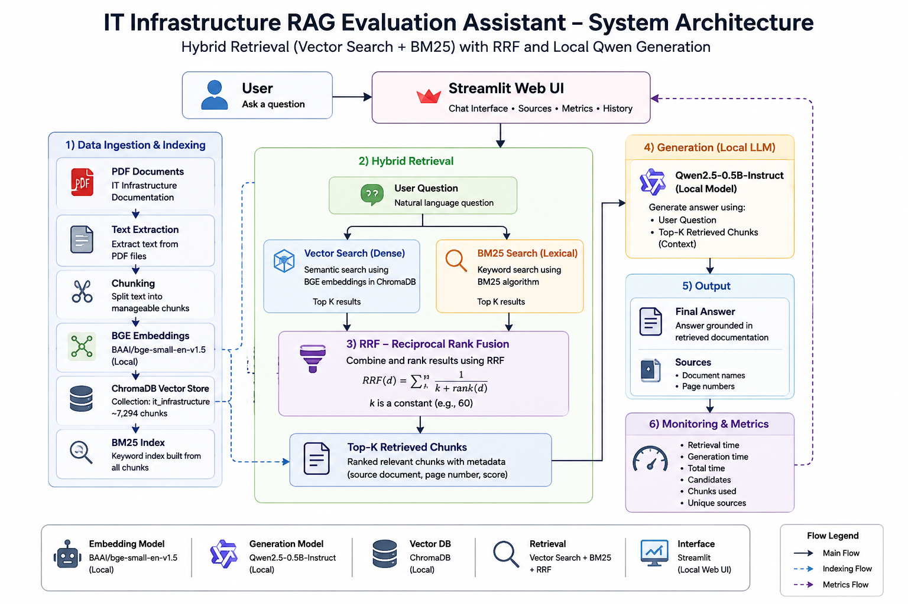
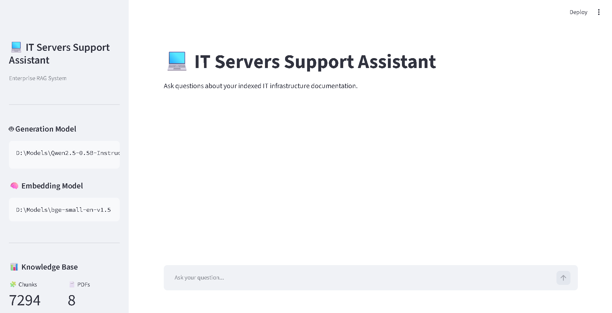
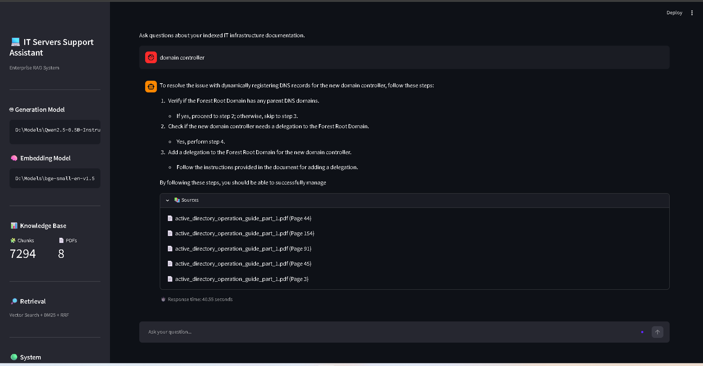
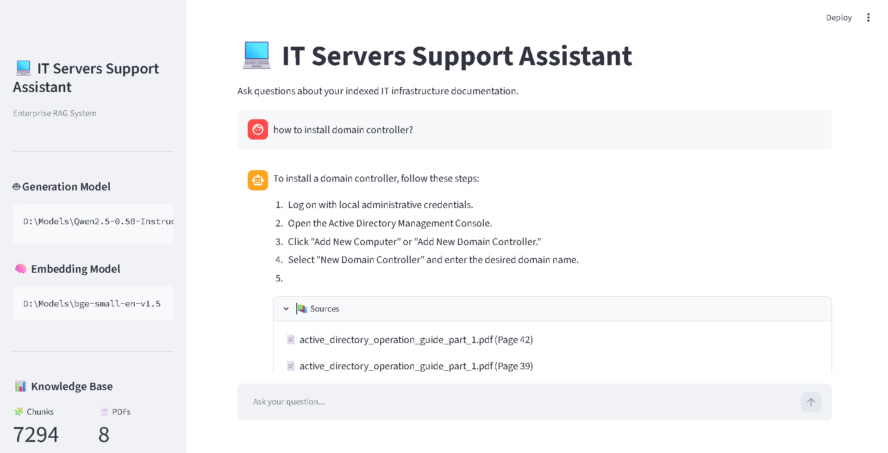
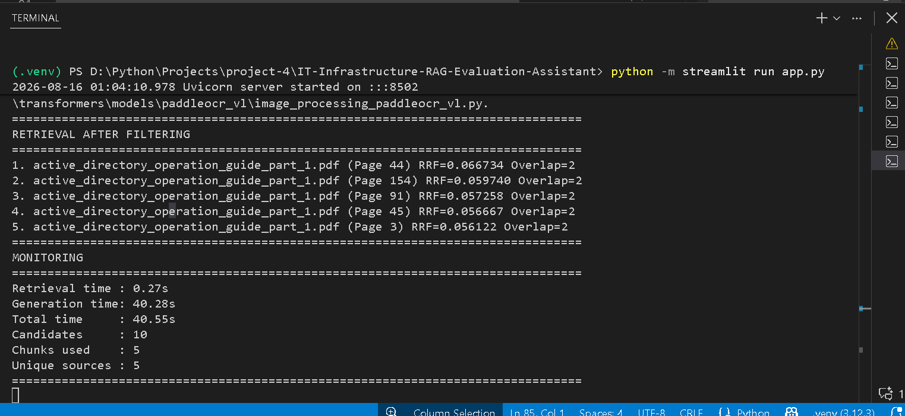
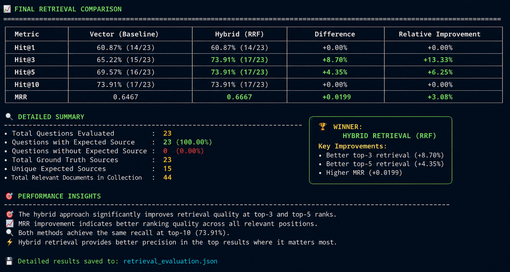

# 💻 IT Infrastructure RAG Evaluation Assistant

An enterprise-style **Retrieval-Augmented Generation (RAG)** assistant for answering IT infrastructure and server administration questions using a local knowledge base.

The system combines **semantic vector search**, **BM25 keyword retrieval**, and **Reciprocal Rank Fusion (RRF)** to improve document retrieval quality before generating answers with a local **Qwen2.5-0.5B-Instruct** model.

---

## 📌 Project Overview

The goal of this project is to build a practical RAG system that can answer questions about IT infrastructure documentation, including:

* VMware vSphere
* Windows Server
* Active Directory
* IBM PowerVM / VIOS
* Server administration
* Virtualization
* Infrastructure operations

The complete pipeline runs locally:

```text
User Question
      │
      ▼
Hybrid Retrieval
      │
      ├── Vector Search
      │
      ├── BM25 Search
      │
      └── RRF Fusion
      │
      ▼
Relevant Documentation
      │
      ▼
Local Qwen Generator
      │
      ▼
Grounded Answer + Sources
      │
      ▼
Monitoring Metrics
```
--------------
## 🚀 Problem Description

IT infrastructure teams rely on large and diverse technical documentation covering platforms such as **VMware vSphere, Windows Server, Active Directory, IBM PowerVM / VIOS, and server administration**.

Finding the correct technical information across large volumes of documentation can be time-consuming. Traditional keyword-based search may miss semantically relevant information, while general-purpose Large Language Models (LLMs) may generate technically plausible answers that are not supported by the available documentation.

This project addresses these challenges by building a **Retrieval-Augmented Generation (RAG) assistant specifically for IT infrastructure knowledge**.

The system is designed to:

* **Retrieve relevant technical information** from a local knowledge base of IT infrastructure documentation.
* **Combine semantic and keyword retrieval** using vector search and BM25.
* **Improve retrieval ranking** using Reciprocal Rank Fusion (RRF).
* **Generate grounded answers** using a local Qwen2.5-0.5B-Instruct model and the retrieved documentation.
* **Reduce unsupported answers and hallucinations** by restricting generation to the retrieved context.
* **Provide source attribution** so users can identify the documentation used to generate an answer.
* **Evaluate retrieval quality objectively** by comparing the hybrid retriever against a vector-search baseline using Hit@K and MRR.

The main goal is not simply to build an IT chatbot, but to create a **reliable and measurable RAG pipeline** where the quality of document retrieval can be evaluated before relying on the generated answers.

---

## 🏗️ Architecture


## 🖥️ Application Interface

## 💬 Question & Answer


## 📊 Monitoring

## 📈 Retrieval Evaluation

### Main Components

| Component         | Technology                   |
| ----------------- | ---------------------------- |
| UI                | Streamlit                    |
| Generation Model  | Qwen2.5-0.5B-Instruct        |
| Embedding Model   | BAAI BGE-small-en-v1.5       |
| Vector Database   | ChromaDB                     |
| Keyword Retrieval | BM25                         |
| Hybrid Fusion     | Reciprocal Rank Fusion (RRF) |
| PDF Processing    | PyMuPDF / pypdf              |
| Language          | Python                       |
| Runtime           | Local Windows Environment    |

---

## 🤖 Models

### Generation Model

```text
Qwen2.5-0.5B-Instruct
```

The model is loaded completely locally from:

```text
D:\Models\Qwen2.5-0.5B-Instruct
```

The generator is configured to answer using the retrieved documentation rather than relying on external knowledge.

### Embedding Model

```text
BAAI/bge-small-en-v1.5
```

Local model path:

```text
D:\Models\bge-small-en-v1.5
```

The embedding model is used for semantic vector retrieval.

---

## 🔎 Hybrid Retrieval

The project implements a hybrid retrieval architecture combining two retrieval methods.

### 1. Vector Search

The question is converted into an embedding using the local BGE model.

ChromaDB is then used to retrieve semantically similar document chunks.

### 2. BM25

BM25 provides keyword-based retrieval.

This is useful for infrastructure terminology, commands, product names, acronyms, and exact technical terms.

Examples:

```text
vMotion
vSphere HA
SYSVOL
VIOS
DHCP
Active Directory
```

### 3. Reciprocal Rank Fusion

The vector and BM25 rankings are combined using RRF.

```text
Vector Search
      +
BM25 Search
      │
      ▼
     RRF
      │
      ▼
Final Ranked Results
```

This allows the system to benefit from both semantic similarity and exact keyword matching.

---

## 📚 Knowledge Base

The knowledge base contains IT infrastructure documentation covering multiple technologies.

Examples include:

* VMware vSphere 7.0
* Microsoft Windows / Windows Server
* Active Directory
* IBM PowerVM
* Azure Stack
* Server administration documentation

The documents are converted into text, divided into chunks, embedded, and stored in ChromaDB.

---

## 🧩 Vector Database

The project uses **ChromaDB** as the local vector database.

Configuration:

```python
CHROMA_PATH = "chroma_db"
COLLECTION_NAME = "it_infrastructure"
```

The current indexed database contains approximately:

```text
7294 indexed chunks
```

The exact number may change after rebuilding the index.

---

## 🧠 RAG Pipeline

The main RAG workflow is:

### Step 1 — User Question

Example:

```text
What is VMware vMotion?
```

### Step 2 — Hybrid Retrieval

The system retrieves candidate chunks using:

```text
Vector Search
+
BM25
+
RRF
```

### Step 3 — Candidate Filtering

The retrieved candidates are filtered and ranked before being passed to the generator.

### Step 4 — Context Construction

Relevant document chunks are combined into a context containing:

```text
Source
Page
Content
```

### Step 5 — Local Generation

Qwen generates an answer using the retrieved documentation.

### Step 6 — Sources

The application displays the document and page used for the answer.

### Step 7 — Monitoring

The system records:

* Retrieval time
* Generation time
* Total response time
* Candidate chunks
* Retrieved chunks
* Unique sources

---

## 📊 Monitoring

The RAG pipeline includes basic performance monitoring.

Example:

```text
================================================================================
MONITORING
================================================================================
Retrieval time : 0.08s
Generation time: 6.82s
Total time     : 6.89s
Candidates     : 10
Chunks used    : 5
Unique sources : 5
================================================================================
```

The monitoring information helps identify the main performance bottleneck.

In the local setup, retrieval is generally fast while text generation is the dominant part of the response time.

---

## 📈 Retrieval Evaluation

The project evaluates the retrieval system by comparing:

```text
Vector Retrieval
vs.
Hybrid Retrieval
```

The evaluation uses:

* Hit@1
* Hit@3
* Hit@5
* Hit@10
* MRR

### Final Results

| Metric | Vector Baseline | Hybrid RRF |  Difference |
| ------ | --------------: | ---------: | ----------: |
| Hit@1  |          60.87% |     60.87% |      +0.00% |
| Hit@3  |          65.22% | **73.91%** |  **+8.70%** |
| Hit@5  |          69.57% | **73.91%** |  **+4.35%** |
| Hit@10 |          73.91% |     73.91% |      +0.00% |
| MRR    |          0.6467 | **0.6667** | **+0.0199** |

### Evaluation Conclusion

The **Hybrid RRF retriever** performed better overall.

The main improvements were:

* Higher Hit@3
* Higher Hit@5
* Higher MRR
* Better ranking quality in the top results

The largest improvement was:

```text
Hit@3: +8.70 percentage points
```

Detailed evaluation results are stored in:

```text
retrieval_evaluation.json
```

---

## 📸 Evaluation


---

## 🖥️ Application Interface

The project provides a Streamlit interface for interacting with the RAG system.


The interface displays:

* Generation model
* Embedding model
* Knowledge-base statistics
* Number of indexed chunks
* Number of PDF documents
* Retrieval architecture
* Chat interface
* Retrieved sources
* Response time

---

## 📂 Project Structure

```text
IT-Infrastructure-RAG-Evaluation-Assistant/
│
├── data/
│   └── *.pdf
│
├── chroma_db/
│   └── ChromaDB files
│
├── screenshots/
│   ├── architecture.png
│   ├── dashboard.png
│   └── evaluation.png
│
├── app.py
├── rag_hybrid.py
├── hybrid_search.py
├── vector_store.py
├── qwen_generator.py
├── gemini_generator.py
├── embeddings.py
├── document_loader.py
├── chunker.py
├── build_index.py
├── evaluate_retrieval.py
├── test_rag.py
├── config.py
├── retrieval_evaluation.json
├── requirements.txt
└── README.md
```

---

## ⚙️ Configuration

The main configuration is stored in `config.py`.

```python
MODEL_NAME = r"D:\Models\Qwen2.5-0.5B-Instruct"

EMBEDDING_MODEL_PATH = r"D:\Models\bge-small-en-v1.5"

CHROMA_PATH = "chroma_db"

COLLECTION_NAME = "it_infrastructure"
```

Update the model paths if the models are stored in a different location.

---

## 🚀 Installation
### Requirements

- Windows 10/11
- Python 3.12+
- Git
- Sufficient RAM for the local Qwen model
- Local BGE embedding model
- Local Qwen2.5-0.5B-Instruct model

The project is designed to run locally.
No Docker is required.
No external LLM API is required for the main RAG pipeline.
### 1. Clone the repository

```bash
git clone <YOUR_GITHUB_REPOSITORY_URL>
cd IT-Infrastructure-RAG-Evaluation-Assistant
```

### 2. Create a virtual environment

Windows PowerShell:

```powershell
python -m venv .venv
```

Activate it:

```powershell
.\.venv\Scripts\Activate.ps1
```

### 3. Install dependencies

```powershell
pip install -r requirements.txt
```

---

## 📥 Build the Index

Place the PDF documentation inside:

```text
data/
```

Then run:

```powershell
python build_index.py
```

The indexing process:

```text
Load PDFs
   ↓
Extract text
   ↓
Chunk documents
   ↓
Generate BGE embeddings
   ↓
Store vectors in ChromaDB
```

---

## ▶️ Run the Application

Start Streamlit:

```powershell
python -m streamlit run app.py
```

Then open the local Streamlit URL shown in the terminal.

---

## 🧪 Test the RAG Pipeline

Run:

```powershell
python rag_hybrid.py
```

The test executes several infrastructure questions and displays:

* Retrieved documents
* RRF scores
* Generated answer
* Sources
* Monitoring metrics

Example questions:

```text
What is vSphere HA?
```

```text
What is VMware vMotion?
```

```text
What is Windows Server management?
```

```text
What is an authoritative restore of SYSVOL?
```

```text
What is a Virtual I/O Server (VIOS)?
```

---

## 📊 Run Retrieval Evaluation

Run:

```powershell
python evaluate_retrieval.py
```

The evaluation compares the baseline vector retriever against the hybrid retriever.

The results are saved to:

```text
retrieval_evaluation.json
```

---

## 🛡️ Grounded Generation

The generator is configured with strict RAG instructions.

The intended behavior is:

```text
Documentation
     ↓
Retrieved Context
     ↓
Qwen
     ↓
Grounded Answer
```

The model is instructed to:

* Use the provided documentation
* Avoid unsupported information
* Avoid guessing
* Avoid inventing technical details
* Ignore irrelevant retrieved documents
* Return an explicit fallback when the documentation does not support an answer

Fallback response:

```text
I don't know based on the indexed documentation.
```

---

## ⏱️ Performance

The project separates retrieval and generation timing.

Example local execution:

```text
Retrieval time : ~0.08s
Generation time: ~6.82s
Total time     : ~6.89s
```

Performance depends on:

* CPU
* Available RAM
* Context size
* Number of generated tokens
* Qwen model size
* Number of retrieved chunks

Because the generator runs locally on CPU, generation is significantly slower than retrieval.

---

## 🔬 Design Decisions

### Why BGE?

A local BGE embedding model provides semantic retrieval without requiring an external embedding API.

### Why BM25?

Technical documentation contains many exact terms and acronyms. BM25 provides strong keyword matching alongside semantic retrieval.

### Why RRF?

RRF provides a simple way to combine rankings from different retrieval systems without requiring the scores from both systems to be directly comparable.

### Why Qwen?

Qwen2.5-0.5B-Instruct is small enough to run locally on a limited-resource machine while providing an instruction-following generation model.

### Why Local Execution?

The final implementation avoids dependence on external LLM inference for the main RAG pipeline.

This provides:

* Local execution
* No per-query API cost
* Better control over documentation
* Reproducible experiments
* Offline-capable inference after models and dependencies are installed

---

## 📌 Current System Status

```text
✅ PDF document ingestion
✅ Document chunking
✅ Local BGE embeddings
✅ ChromaDB vector storage
✅ Vector retrieval
✅ BM25 retrieval
✅ Hybrid RRF retrieval
✅ Candidate filtering
✅ Local Qwen generation
✅ Source attribution
✅ Streamlit interface
✅ Response-time monitoring
✅ Retrieval evaluation
✅ Baseline vs Hybrid comparison
```

---

## 🎯 Final Result

The project demonstrates a complete local RAG pipeline for IT infrastructure documentation:

```text
                 ┌─────────────────────┐
                 │    IT Documents     │
                 │       PDFs          │
                 └──────────┬──────────┘
                            │
                            ▼
                 ┌─────────────────────┐
                 │  Document Processing│
                 │  Chunking + BGE     │
                 └──────────┬──────────┘
                            │
                            ▼
                    ┌───────────────┐
                    │   ChromaDB    │
                    └───────┬───────┘
                            │
User Question ──────────────┤
                            │
             ┌──────────────┴──────────────┐
             │                             │
             ▼                             ▼
      Vector Search                     BM25
             │                             │
             └──────────────┬──────────────┘
                            ▼
                       RRF Fusion
                            │
                            ▼
                    Relevant Context
                            │
                            ▼
                 Qwen2.5-0.5B-Instruct
                            │
                            ▼
                 Grounded Answer + Sources
                            │
                            ▼
                       Monitoring
```

---

## 👨‍💻 Project

**IT Infrastructure RAG Evaluation Assistant**

Built as a practical RAG project for the **LLM Zoomcamp 2026**.

The project focuses on building, evaluating, and monitoring a production-style retrieval pipeline for enterprise IT documentation.
